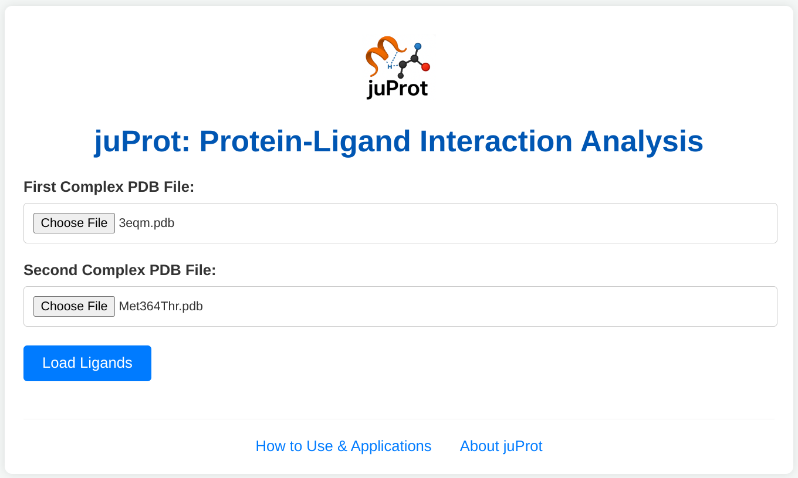
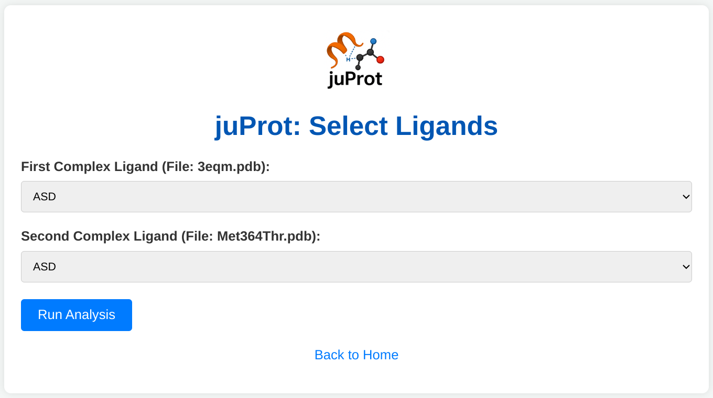
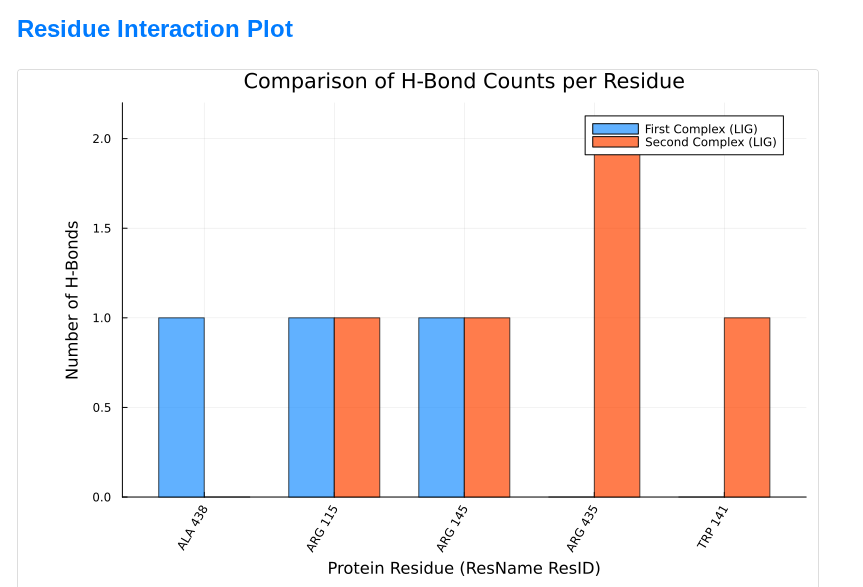

# juProt: A Standalone Application for Comparative Protein-Ligand Analysis

<p align="center">
  
</p>

[](https://github.com/drbenedictpaul/juprot/releases/tag/v1.0)
[](LICENSE)

**juProt** is an open-source, standalone application designed to streamline the comparative analysis of protein-ligand interaction networks. It helps researchers quickly identify differences and commonalities in how ligands bind to proteins by analyzing **Hydrogen Bonds, Hydrophobic Contacts, Salt Bridges, Pi-Stacking, and more.**

---

### **Status Update: Transition to a Standalone Application**

This project was originally published as a web service. To ensure its **long-term availability** and provide a more robust, cost-effective distribution model, **juProt has been transitioned into a standalone, Dockerized application** that runs locally on your machine.

The core scientific functionality and user interface remain the same as described in our publication, with the significant upgrade of supporting the full non-covalent interactome.

---

## How to Use juProt (Standalone Version)

**The application now runs locally on your machine. No web hosting is required.**

1.  **Prerequisites:** You must have **Docker** installed on your Linux system.
2.  **Download:** Go to the **[Official Releases Page](https://github.com/drbenedictpaul/juprot/releases)** and download the latest `juprot-linux-vX.Y.tar.gz` file.
3.  **Run:** Decompress the file (`tar -xzvf ...`) and follow the simple instructions in the included `README.md` file to start the application.

## Key Features

*   **User-Friendly Interface:** A simple web interface running locally on your machine.
*   **Comprehensive Interaction Analysis:** Leverages the PLIP engine for robust detection of a wide range of non-covalent interactions.
*   **Comparative Outputs:**
    *   **2D Spatial Pocket Map:** A new graphical output showing the geometric arrangement of interacting residues in the binding pocket.
    *   **Bar Charts:** Visual comparison of interaction counts per residue, color-coded by type.
    *   **Data Downloads:** Detailed CSV files for both summary and in-depth analysis.
    *   **Analytical Summary:** A text-based summary of key differences, including fold-changes.
*   **Open Source:** Built with Julia and the Genie.jl framework.

## Technology Stack

*   **Backend & Web Framework:** [Julia](https://julialang.org/) with [Genie.jl](https://genieframework.com/)
*   **Interaction Engine:** [PLIP](https://github.com/pharmai/plip) (Python-based)
*   **Distribution:** [Docker](https://www.docker.com/)

## Screenshots





## For Developers: Local Setup & Contribution

The recommended way to run the application is via the distributed Docker package. However, if you wish to run the source code directly for development:

**Prerequisites:**
*   Julia (v1.11+)
*   Docker (for building the development environment)

**Setup Steps:**
1.  **Clone the repository:**
    ```bash
    git clone https://github.com/drbenedictpaul/juprot.git
    cd juprot
    ```
2.  **Start the application:**
    ```bash
    bash bin/server
    ```
    The first time you run this, Julia's package manager (`Pkg.jl`) will automatically resolve and install all Julia and Python dependencies as defined in the project files (`Project.toml`, `Manifest.toml`, `CondaPkg.toml`). This may take several minutes. Subsequent startups will be much faster.

## Citation

If you use juProt in your research, please cite our publication:

> *[Paul, B.C., S. P., D., V., S. et al. juProt: A web application for comparative analysis of protein–ligand interactomes. In Silico Pharmacol. 14, 81 (2026) https://doi.org/10.1007/s40203-026-00588-6]*

The source code for the version used in the publication is available under the `v1.0` tag.

---