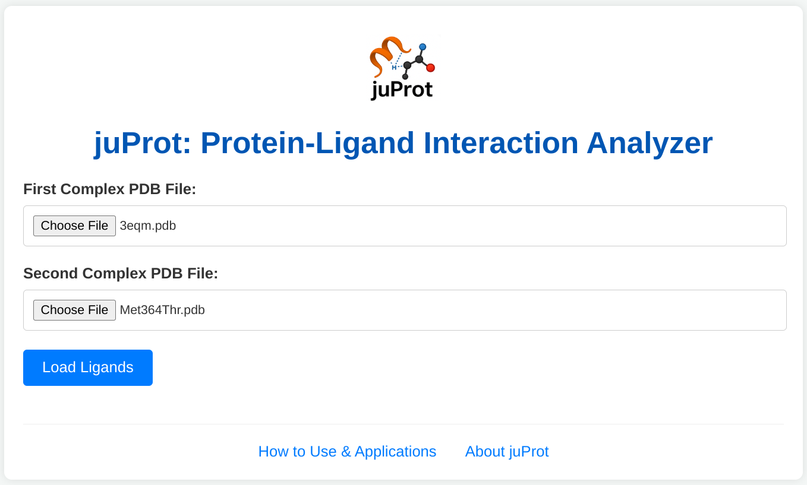

# juProt: Protein-Ligand Interaction Analyzer

<!-- Optional: If you have a logo image file (e.g., in a folder like `assets/logo.png` in your repo), you can uncomment and use this:
-->
<p align="center">
  
</p>


<!-- [](https://opensource.org/licenses/MIT) Replace MIT with your chosen license if different -->

**juProt is an open-source web application designed to streamline the comparative analysis of protein-ligand interaction networks, with a current focus on hydrogen bonds.** It helps researchers quickly identify differences and commonalities in how ligands bind to proteins under varying conditions, such as structural mutations or when comparing different molecules.

**Live Application:** Access juProt at [**https://juprot.info/**](https://juprot.info/)

## Key Features

*   **User-Friendly Web Interface:** No installation required. Simply upload two PDB files and select ligands for comparison.
*   **Automated Interaction Analysis:** Leverages the PLIP engine for robust detection of interactions (currently specializing in H-bonds).
** PLIP: Sebastian Salentin, Sven Schreiber, V. Joachim Haupt, Melissa F. Adasme, Michael Schroeder, PLIP: fully automated protein–ligand interaction profiler, Nucleic Acids Research, Volume 43, Issue W1, 1 July 2015, Pages W443–W447, https://doi.org/10.1093/nar/gkv315
*   **Comparative Outputs:**
    *   Side-by-side summary tables (CSV) highlighting key H-bond differences and statistics.
    *   Detailed lists of all detected H-bonds (CSV) for both complexes.
    *   Visual bar charts comparing H-bond counts per residue.
    *   On-page analytical summaries.
*   **Open Source:** Built with Julia and the Genie.jl framework, with all source code available for transparency and community contributions.

## Motivation

Understanding detailed changes in protein-ligand interactions (e.g., due to mutations affecting drug binding, or comparing different drug candidates) is vital in structural biology and drug discovery. While tools exist to analyze single complexes, comparing two distinct scenarios often requires manual data processing and scripting. juProt aims to automate and simplify this comparative analysis, making it accessible to a broader scientific audience directly through their web browser.

## Technology Stack

*   **Backend & Web Framework:** [Julia](https://julialang.org/) with [Genie.jl](https://genieframework.com/)
*   **Interaction Engine:** [PLIP](https://github.com/pharmai/plip) (Python-based)
*   **Julia-Python Interoperability:** [PythonCall.jl](https://github.com/cjdoris/PythonCall.jl)
*   **Plotting:** [Plots.jl](http://docs.juliaplots.org/latest/) (for server-side plot generation)
*   **Core Python Dependencies (for PLIP):** OpenBabel

## Screenshots

<!-- 
Replace these with actual paths to screenshots in your repository (e.g., create an 'assets' folder)
Example:
-->



<!-- *(Please add 2-3 screenshots here showing the juProt interface: e.g., the main upload page, the ligand selection step, and an example of the results page with the plot and tables.)* -->

## How to Use juProt

juProt is designed for ease of use through its web interface:
1.  Navigate to the live application: [**https://juprot.info/**](https://juprot.info/)
2.  Follow the on-screen instructions to upload your two PDB complex files.
3.  Select the ligand of interest for each complex from the auto-detected options.
4.  Click "Run Analysis" to view and download your comparative results.

For more detailed instructions and application examples, please visit the **[How to Use & Applications page](https://juprot.info/how-to-use)** on the web application. An **[About juProt page](https://juprot.info/about)** is also available.

## For Developers: Local Setup & Contribution

juProt is an open-source project, and contributions are welcome! If you wish to run a local instance for development or contribute to the codebase:

**Prerequisites:**
*   Julia (see `Project.toml` for version, e.g., v1.11.x)
*   Python (e.g., v3.11.x, compatible with PLIP and dependencies)
*   A Python virtual environment manager (e.g., `venv`)
*   System dependencies for OpenBabel (e.g., `libopenbabel-dev` on Debian/Ubuntu, or equivalent for your OS).
*   Docker (optional, but recommended for replicating the deployment environment as defined in the `Dockerfile`).

**Setup Steps:**
1.  **Clone the repository:**
    ```bash
    git clone https://github.com/drbenedictpaul/juprot.git
    cd juProt
    ```
2.  **Python Environment (Virtual Environment Recommended):**
    ```bash
    python3 -m venv .venv 
    source .venv/bin/activate 
    pip install plip openbabel-wheel
    ```
3.  **Configure PythonCall.jl for Local Julia:**
    Before starting Julia for local development, ensure these environment variables are set for your Julia session (e.g., in your shell or Julia `startup.jl` at `~/.julia/config/startup.jl`):
    *   `ENV["JULIA_PYTHONCALL_EXE"] = "/full/path/to/your/.venv/bin/python"` (replace with the actual absolute path to Python inside your created `.venv`)
    *   `ENV["JULIA_PYTHONCALL_LIB"] = "/full/path/to/your/libpythonX.Y.so"` (e.g., `/usr/lib/x86_64-linux-gnu/libpython3.11.so`. This path is system-dependent and should point to the shared library of the Python version used to create the venv.)
    *   `ENV["JULIA_CONDAPKG_BACKEND"] = "Null"`
    *   `ENV["PYTHON"] = ""`
4.  **Run the Julia application locally:**
    ```julia
    # From the project root directory in Julia REPL
    using Pkg
    Pkg.activate(".")
    Pkg.instantiate() # To install/update Julia dependencies

    # Run the application using bootstrap.jl
    include("bootstrap.jl") 
    ```
    The application should then be accessible (often at `http://localhost:8080` or the port specified in your `bootstrap.jl`).

## Deployment

juProt is designed for deployment on Google Cloud Run using Docker. The `Dockerfile` included in this repository provides the complete build instructions for the container image.

## Future Development

*   Expansion to include comparative analysis for other interaction types detected by PLIP (hydrophobic contacts, π-stacking, salt bridges, etc.) to provide a more comprehensive interactome comparison.
*   Enhanced and interactive visualizations of comparative interactions.
*   Potential support for analyzing more than two complexes simultaneously.
*   User-configurable parameters for interaction detection.

## How to Contribute

We welcome contributions to juProt! Please feel free to fork the repository, make improvements, and submit pull requests. You can also report bugs or suggest features via the GitHub Issues page: `https://github.com/drbenedictpaul/juprot/issues`

## Contributors

juProt was conceived and developed by:

Dr. Benedict Christopher Paul | https://github.com/drbenedictpaul/

Deepak S P, MSc Biotechnology | https://github.com/deepakshankar810

Siva V, MSc Biotechnology | https://github.com/siva1106

Surya Sekaran, [PhD] | https://github.com/suryasmilez21

We also acknowledge the developers of the core libraries used in juProt, including Julia, Genie.jl, PythonCall.jl, PLIP, OpenBabel, and Plots.jl.

## Citation

If you use juProt in your research, please cite:

1.  **The juProt Web Application:** `https://juprot.info/`
2.  **This GitHub Repository:** Benedict et al. 2025. *juProt: Protein-Ligand Interaction Analyzer*. GitHub. Retrieved from `https://github.com/drbenedictpaul/juprot`
3.  **Our Publication:** *Manuscript In Communication*
    <!-- `Benedict Christopher Paul, Deepak S P, Siva V, & Surya Sekaran. (Year). juProt: A Web Application for Comparative Analysis of Protein-Ligand Interactomes. Journal of Biomedical Informatics, Volume, Pages. DOI.` *(Adjust author list and title if the paper title differs slightly).* -->

## License

juProt is licensed under the **GNU AGPLv3**. See the `LICENSE.md` file for details.
<!-- *(Remember to create a LICENSE.md file and put the MIT license text in it. You can get it from: https://opensource.org/licenses/MIT)* -->